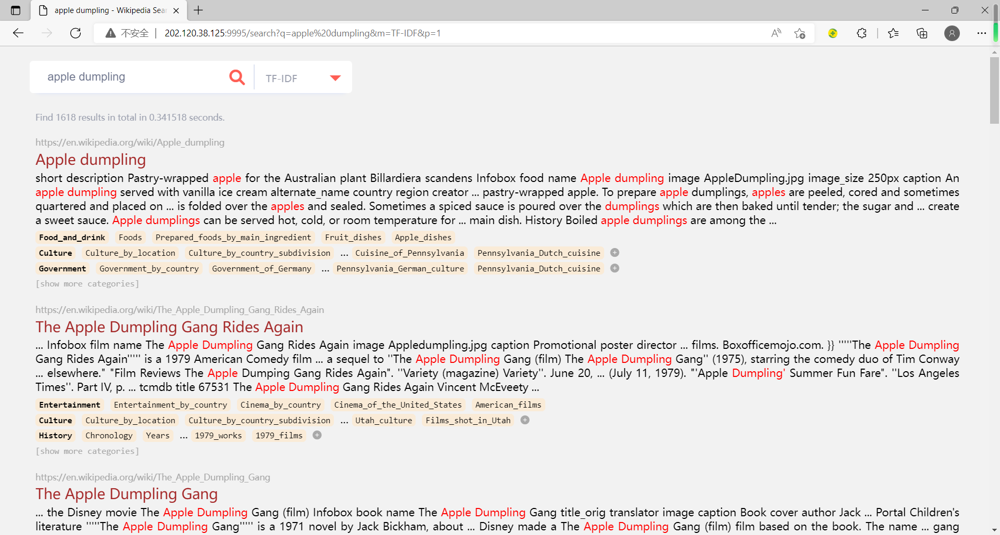

# TinySearchEngine

A tiny search engine of Wikipedia.

- based on ~0.5M pages
- covering 41 [main topics](https://en.wikipedia.org/wiki/Category:Main_topic_classifications)
- including >400k sub-categories

Supports

- [x] 5 different rank methods
- [x] field/category-specific search
- [x] tolerance search, wildcard search
- [x] show the category structure

## Data

The extraction of Wikipedia pages is based on [wiki dump](https://dumps.wikimedia.org/enwiki/latest/).
Please download the following data first.

- The categorylinks table `enwiki-latest-categorylinks.sql.gz` from [link](https://dumps.wikimedia.org/enwiki/latest/enwiki-latest-categorylinks.sql.gz)
- The page table `enwiki-latest-page.sql.gz` from [link](https://dumps.wikimedia.org/enwiki/latest/enwiki-latest-page.sql.gz)
- The XML file of Wikipedia pages, we choose [this one](https://dumps.wikimedia.org/enwiki/latest/enwiki-latest-pages-articles10.xml-p4045403p5399366.bz2)

*Note: it may take ~2 days to load the above two SQL files to a MySQL server.*

## Usage


**Data preprocessing**

Before data preprocessing, please update your SQL configuration in `tree/mysql_config.json`.

*Construct category tree structure*

~~~shell
python ./tree/parse_tree.py --index-folder=/folder/to/save/results
~~~

**Index**

(Reference: https://github.com/DhavalTaunk08/Wiki-Search-Engine)

```shell
python ./search/english_indexer.py path_to_xml_dump
```

**Search**
```shell
python ./search/english_search.py --filename queries.txt --num_results 15
```
The fields **--filename** and **--num_results** are optional. By default **--num_results** is initilaized to **10**. And if you don't pass **--filename** parameter, it will prompt you to enter query on command line.

**Web demo**

~~~shell
python ./server/main.py
~~~

*Below shows some screenshots of the web demo. You can refer to [demo.md](./screenshot/demo.md) for more.*



